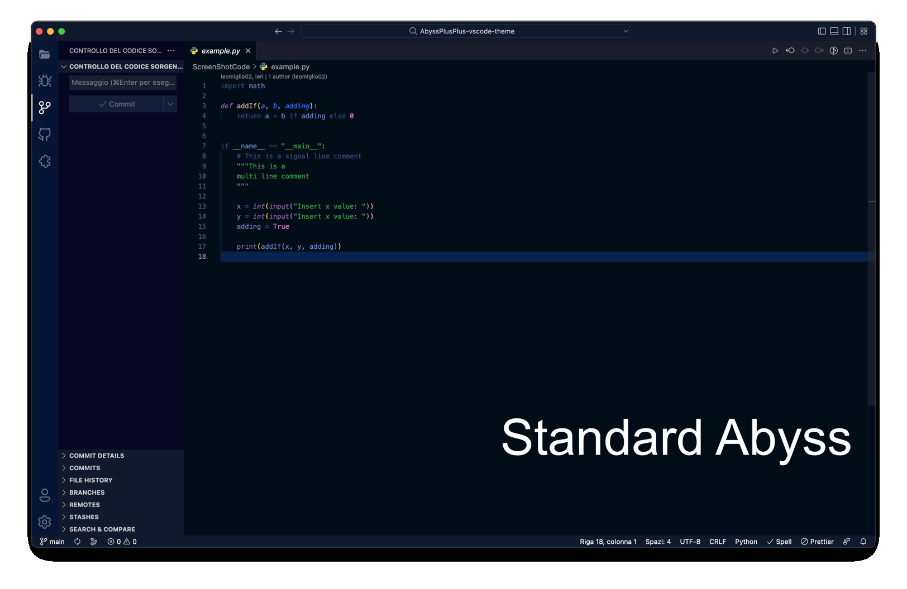

# Abyss++ Theme for VS Code

Thanks for checking out my VS Code theme. Currently there are only two options to choose from (I might add more in the future):

- Abyss++
- Abyss++ No_Italic

## Installation

1. Open the extensions sidebar on Visual Studio Code
2. Search for Abyss++ Theme
3. Click Install
4. Click Reload to reload your VS Code
5. Click Settings icon (bottom left) > Color Theme ＞ Abyss++ Theme

## Issues & Suggestions

For any issues or suggestions, please use [GitHub issues](https://github.com/Glydric22/AbyssPlusPlus-vscode-theme/issues).

Inspired by [Veerhan-glitch](https://github.com/Veerhan-glitch)'s [Abyss+](https://github.com/Veerhan-glitch/AbyssPlus-vscode-theme)